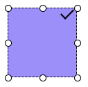

# dom-resizeable
Make dom resizeable

## Snapshot


## Usage
```bash
yarn add dom-resizeable
npm install dom-resizeable
```

```js
// use as commonjs
const Resize = require("dom-resizeable");

// use as ES module
import Resize from "dom-resizeable";

// create resize control ui
const resizeControl = new Resize(document.body, {
  width: 100,
  height: 100,
  dragable: true,
});

const div = document.querySelector("#div");

// bind resize control ui to dom element
resizeControl.bindEditTarget(div);
```

## API
```js
const instance = new Resize(container, options);

// parent element for mount resize ui dom
container

// resize ui config
options = {
  width: 0, // ui control default width
  height: 0, // ui control default height
  draggable: false, // ui control can be drag move
  hideCheckIcon: false, // whether hide confirm icon
  handleSize: 8, // ui control handle size(px)

  onConfirm(e) {
    // confirm icon clicked
  },
}

instance.bindEditTarget(domElement, options)
// target dom element to resize
domElement

// element resize config
options = {
  lockAspectRatio: false, // whether lock aspect ratio when resizing
}
```

## Related Projects
+ https://github.com/daybrush/moveable
+ https://github.com/taye/interact.js
+ https://github.com/easylogic/editor
+ https://github.com/Shopify/draggable